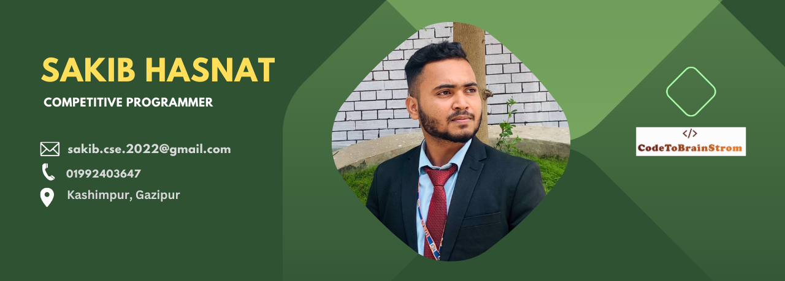

## Hi there 👋

Hi ,I'm a ....

My passion is front-end developer
I'm sakib, a Front-End Developer and Graphics Designer from Bangladesh. I accomplished the 4 years Diploma-in engineering of Computer Science and Technology at Bogura Polytechnic Institute, Bogura. I Spend most of time coding outstanding projects or Creative Design. In terms of experience, I have served as a Campus Ambassador at Creative IT Institute. During my time there from March 2022 to April 2023.

Throughout my academic journey, I have participated in Goverment Training Skill Development for Mobile Game & Application Project (UX/UI Design), ICT Division.

I have a strong command of programming languages such as C, C++, Java and JavaScript. I am proficient in concepts related to Data Structures and Algorithms (DSA) and Object-Oriented Programming (OOP). Additionally, I have hands-on experience with technologies and tools like HTML, CSS, Bootstrap, jQuery, Java Script and MySQL.

coding

👨‍🎓 I’m currently a Student at IUBAT University

📚 I’m currently learning BCSE

👨‍💻 I'm currently working Front-End Web Development

💬 Ask me about Web Related

📫 How to reach me 

⚡ Fun fact So much discus do when i learn new skills

🌐 Connect with me :
Facebook Instagram LinkedIn Behance X YouTube

